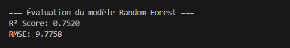

# 💡 Projet Big Data PySpark - Prédiction du taux de suicide

Ce projet a pour objectif de prédire le taux de suicide à partir de données démographiques en utilisant PySpark et un modèle de régression Random Forest.

---

## ⚙️ Technologies utilisées

- Apache Spark (PySpark)
- Python 
- Docker / Docker Compose
- VS Code
- Git

---

## 🔍 Objectif

Créer un pipeline PySpark pour :

- Nettoyer et préparer les données.
- Encoder les variables catégorielles (`country`, `sex`, `age`).
- Assembler les features avec `VectorAssembler`.
- Entraîner un modèle Random Forest.
- Évaluer la performance avec R² et RMSE.
- Sauvegarder et recharger le modèle.

---

## 🚀 Entraînement du modèle

docker-compose run spark python3 main.py
docker-compose run spark python3 predict.py

## Résultat de l'entraînement :
Voici une capture d’écran de l’exécution de `main.py`, qui entraîne un modèle Random Forest, évalue les performances (R² et RMSE), et sauvegarde le modèle :

## 🔍 Prédiction avec un modèle sauvegardé

Voici la prédiction faite via `predict.py`, en utilisant un PipelineModel rechargé :

